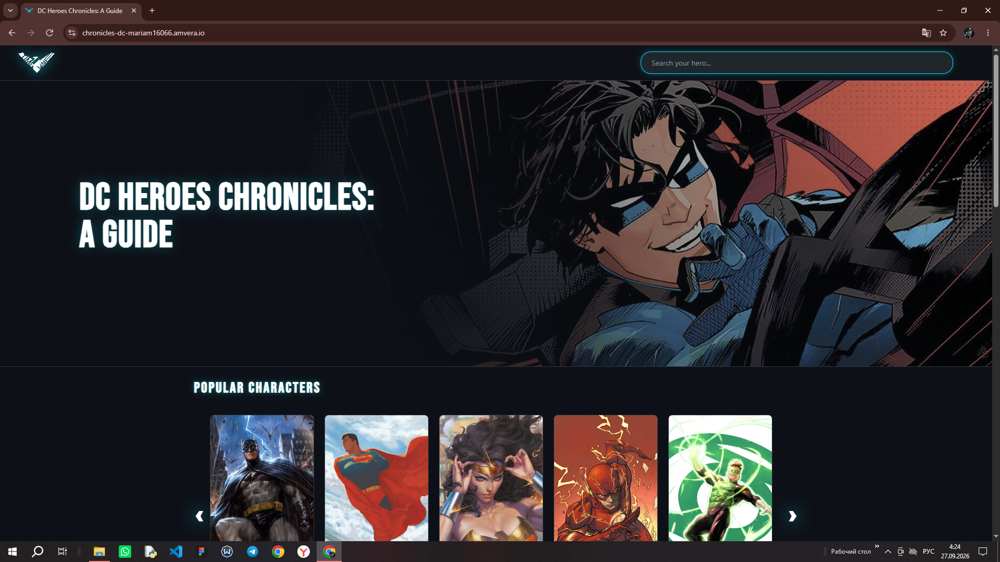
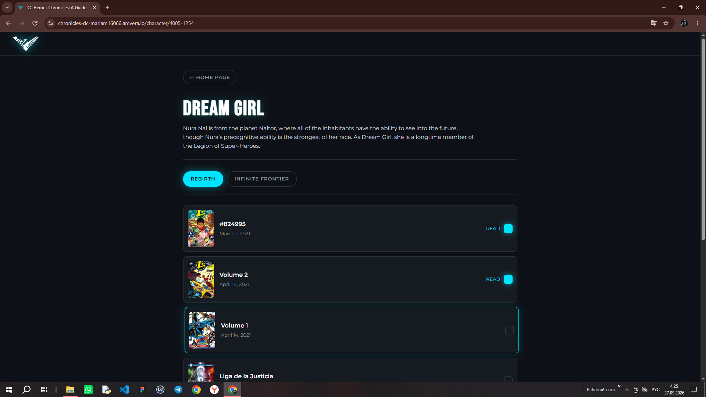
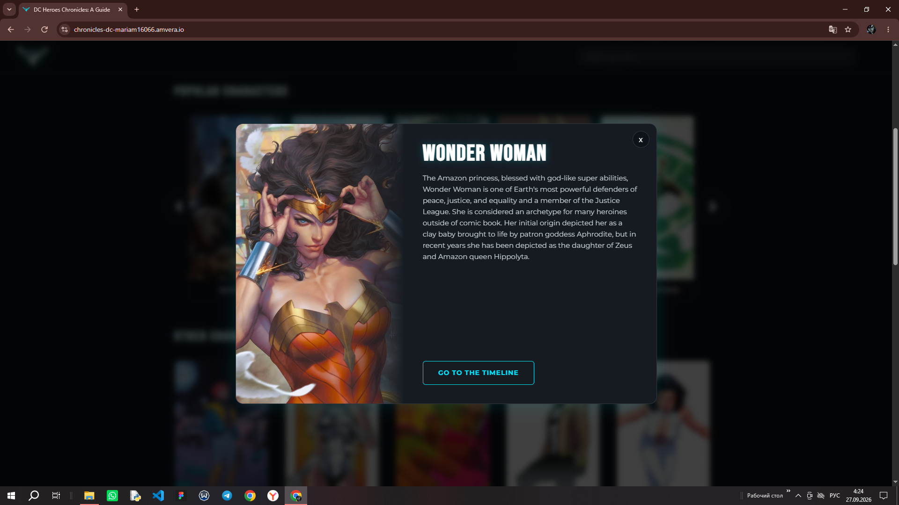

# DC Heroes Chronicles: A Guide

Сайт-гид по хронологии персонажей DC Comics. Пользователь может искать героев, смотреть их хронологию по вселенным (New 52, Rebirth и т.д.) и отмечать прочитанные выпуски.

## 🚀 Демо

- **Сайт:** [chronicles-dc-mariam16066.amvera.io](https://chronicles-dc-mariam16066.amvera.io/)
- **Репозиторий:** [github.com/marbat16/dc-heroes-chronicles](https://github.com/marbat16/dc-heroes-chronicles)

## ✨ Возможности

- **Поиск персонажей** — через API Comic Vine
- **Хронология выпусков** — с сортировкой по дате
- **Группировка по вселенным** — New 52, Rebirth, Classic и другие
- **Отметка "Прочитано"** — сохраняется в localStorage
- **Модальное окно** — с картинкой, именем и описанием персонажа
- **Пагинация** — подгрузка выпусков по 30 штук
- **Адаптивный дизайн** — тёмная тема в стиле DC

## 🛠 Технологии

- **React** — UI-библиотека
- **React Router** — маршрутизация
- **Vite** — сборка
- **CSS Modules** — стилизация
- **Comic Vine API** — источник данных
- **Node.js + Express** — прокси-сервер для обхода CORS
- **Amvera** — хостинг (работает в России без VPN)

## 📦 Запуск локально

```bash
# Клонировать репозиторий
git clone https://github.com/marbat16/dc-heroes-chronicles.git

# Перейти в папку
cd dc-heroes-chronicles

# Установить зависимости
npm install

# Запустить dev-сервер
npm run dev
```
## 🔧 Сборка
```bash
npm run build
```
## 📝 Лицензия
Проект создан в учебных целях.

## 📸 Скриншоты

### Главная страница


### Страница персонажа с хронологией


### Модальное окно с описанием
